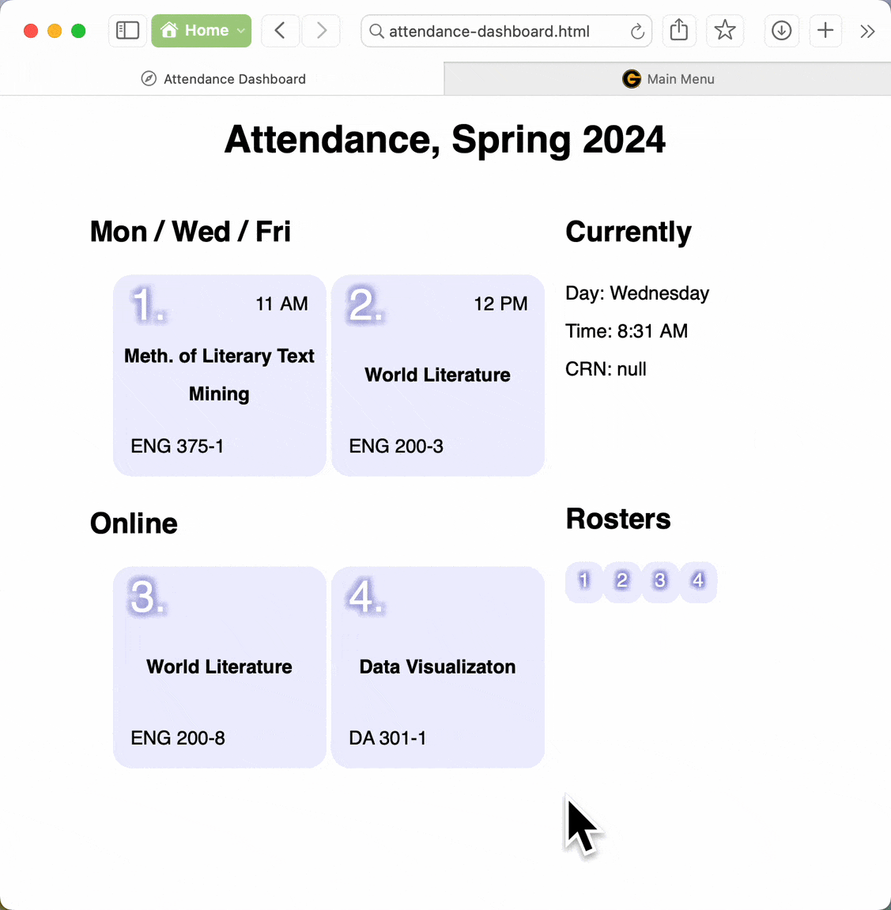

```{r, include = FALSE}
knitr::opts_chunk$set(
  collapse = TRUE,
  comment = "#>"
)
```

The bannr package was written to help access and manage course registration data from Banner, typically viewed in a web browser from a university website. 

## Starting a session

After installation, load the package with `library()`. On first use, `authorize()` will request and store some key values before logging in to Banner; subsequent use will rely on previously saved values.

Save output from `authorize()` to a named object to use the connection multiple times throughout a given session:

```{r authorize1, eval=FALSE, include=TRUE}
library(bannr)
current_session <- authorize()
```

Alternatively, pipe it directly into other package functions for one-time use:

```{r authorize2, eval=FALSE, include=TRUE}
class_rosters <- authorize() |> 
  get_rosters()
```

## Processing data

Once authorized, package functions combine well with common methods for working with data.

```{r processing1, eval=FALSE, include=TRUE}
library(dplyr)
eng200_attendance <- current_session |> 
  process_attendances() |> 
  filter(course == "World Literature") |> 
  arrange(attend_rate)

all_seniors <- current_session |> 
  get_rosters() |> 
  flatten_rosters() |> 
  filter(classification == "Senior") |> 
  select(course, name, major)
```

## Making a dashboard

To avoid potentially submitting data in error, bannr is deliberately limited to functions for retrieving data. Still, the package can also help with common tasks such as entering attendance at the beginning of class. The `make_attendance_dashboard()` function prepares an HTML file with direct links to take attendance for classes listed, with today's date filled out:

```{r example4, eval=FALSE, include=TRUE}
current_session |> 
  get_rosters() |> 
  flatten_rosters() |> 
  make_attendance_dashboard("attendance-dashboard.html")
```

The resulting dashboard makes it easy to jump to the final step for recording today's class attendance, a task required of many instructors.

{style="max-width:100%;"}
